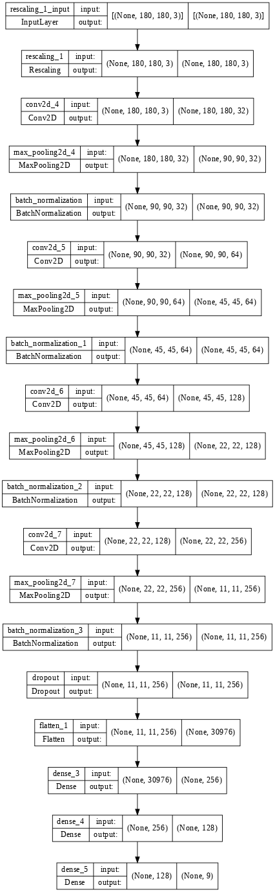

# Melanoma Detection
> To build a CNN based model which can accurately detect melanoma.

## Table of Contents
* [General Info](#general-information)
* [Technologies Used](#technologies-used)
* [Conclusions](#conclusions)
* [Acknowledgements](#acknowledgements)

## General Information
Melanoma is a type of cancer that can be deadly if not detected early. It accounts for 75% of skin cancer deaths. A solution that can evaluate images and alert dermatologists about the presence of melanoma has the potential to reduce a lot of manual effort needed in diagnosis.
- Goal is to To build a custom (Without transfer learning )CNN based model which can accurately detect melanoma.
- Dataset:
The dataset consists of 2357 images of malignant and benign oncological diseases, which were formed from the International Skin Imaging Collaboration (ISIC). 
All images were sorted according to the classification taken with ISIC, and all subsets were divided into the same number of images, with the exception of melanomas and moles, whose images are slightly dominant.

* The data set contains the following diseases:
* Actinic keratosis
* Basal cell carcinoma
* Dermatofibroma
* Melanoma
* Nevus
* Pigmented benign keratosis
* Seborrheic keratosis
* Squamous cell carcinoma
* Vascular lesion
## Model Architecture

## Conclusions
- Intial model was built without Batch normalization and dropouts. Difference between train and validation accuracy was very high. 
- Second model was built with Batch normalization and bias. Model performance increased a bit but the model was overfitting.
- Third model was built with Batch normalization ,small dropouts at FC layer. The model was  still overfitting.
- Then we observed high class imbalance in the Model, as the cause of huge overfitting. Augmentation strategy was used to rectify the problem. 
- We used the augmentor to generate balanced train data for all classes.
- Class imbalance problem was rectified and model was retrained. 
- Train accuracy 95% and Validation accuracy 84%

## Technologies Used
Python, Pandas, Numpy, Matplotlib, PathLib, TensorFlow, Keras, Glob, Augmentor

## Acknowledgements
Give credit here.
- This project was inspired by IIIT, Bangalore and Upgrad, Bangalore.
